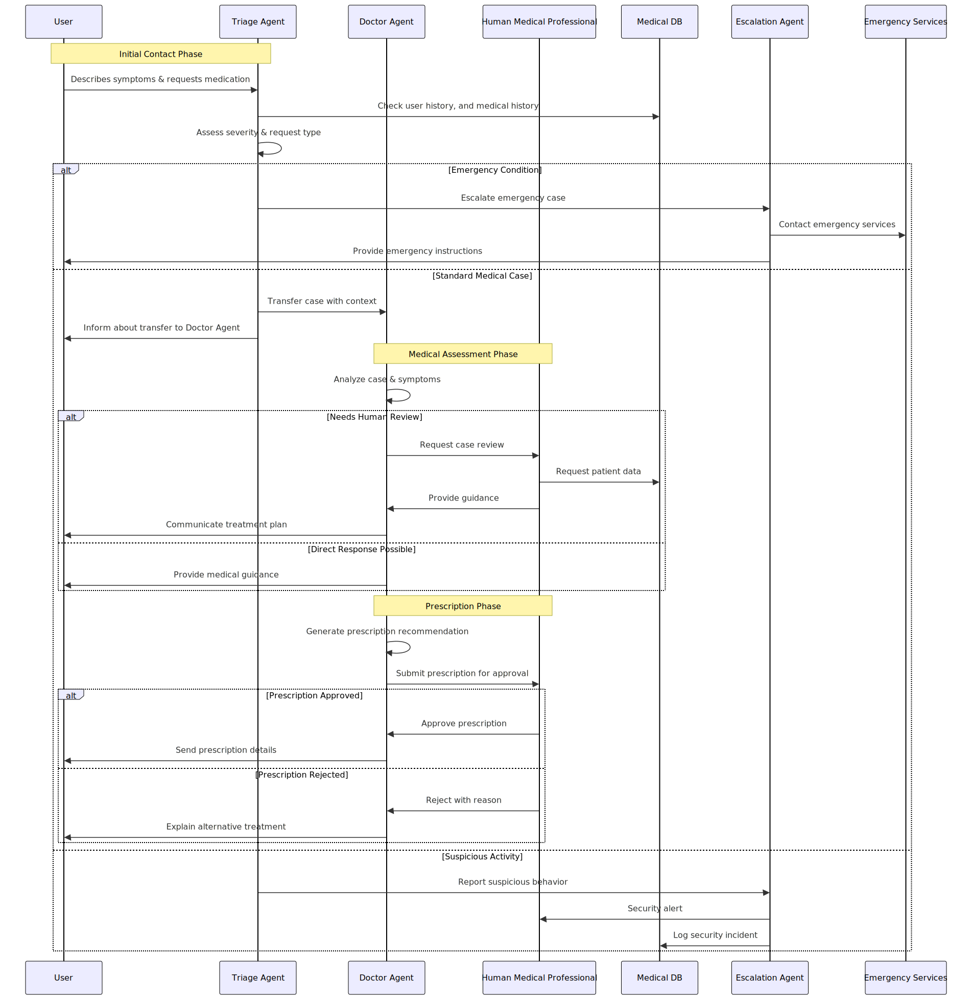

# Healthcare Triage System Using OpenAI Swarm Framework

This repository provides a proof-of-concept (POC) system for healthcare triage, developed using the [OpenAI Swarm Framework](https://github.com/openai/swarm). The POC is designed to handle dynamic healthcare scenarios, with multiple agent roles to assess patient symptoms, make real-time decisions, and escalate cases to human medical professionals when needed.

## Table of Contents

- [Healthcare Triage System Using OpenAI Swarm Framework](#healthcare-triage-system-using-openai-swarm-framework)
  - [Table of Contents](#table-of-contents)
  - [Overview](#overview)
  - [Key Features](#key-features)
  - [Architecture](#architecture)
  - [Setup](#setup)
    - [Requirements](#requirements)
    - [Environment Variables](#environment-variables)
  - [Usage](#usage)
  - [Agents Overview](#agents-overview)
    - [Triage Agent](#triage-agent)
    - [Doctor Agent](#doctor-agent)
    - [Escalation Agent](#escalation-agent)
  - [Limitations](#limitations)
  - [Disclaimer](#disclaimer)

## Overview

This POC simulates a **healthcare triage system** using Swarm's agent-based approach, where agents operate as a team to conduct patient assessments. It demonstrates how agents could triage processes in healthcare. Key functions include symptom assessment, severity evaluation, and **Human-in-the-Loop (HITL)** functionality for cases that require medical professional oversight.

This POC is not intended for deployment in real healthcare settings but instead showcases the potential of agent-based AI for complex decision-making.

## Key Features

- **Multiple Agent Roles:** Agents collaborate to triage, escalate, and respond to patient symptoms.
- **Dynamic Decision-Making:** Decisions adapt based on symptom severity.
- **HITL (Human-in-the-Loop) Functionality:** Supports human intervention for high-risk or complex cases.
- **Escalation to Emergency Services:** Critical cases are automatically escalated to emergency services.
- **Content Filtering:** Leveraging Azure OpenAI's built-in content filters for added safety and compliance.

## Architecture
This POC relies on several coordinated agents, each with distinct responsibilities:

1. **Triage Agent:** Assesses patient symptoms and determines the appropriate response level.
2. **Doctor Agent:** Handles cases requiring medical intervention, including prescriptions.
3. **Escalation Agent:** Manages emergency escalation to 911 or appropriate authorities.

**Sequence Diagram:** 
 

## Setup

### Requirements

- **Azure OpenAI API Access**: This POC uses Azure's OpenAI API, but you can substitute with other OpenAI API instances.
- **GPT-4 Model**: The code is optimized for OpenAI’s GPT-4o-mini, using its function calling feature.
- **Dependencies**:
  ```bash
  pip install -r requirements.txt
  ```

### Environment Variables

Define the following environment variables in a `.env` file (see `.env.example`):
```bash
AZURE_OPENAI_KEY=your_azure_openai_key
AZURE_OPENAI_ENDPOINT=your_openai_endpoint_url
```

## Usage

1. **Run the Triage System**:
   ```bash
   python ./src/app.py
   ```
2. **Agent Interaction**: The agents will interact with users based on the provided input and escalate to HITL when needed.

**Note**: The POC relies on OpenAI's function-calling feature, which currently only supports OpenAI’s proprietary models, meaning local or open-source alternatives cannot be used here.

## Agents Overview

The POC implements several specialized agents, each playing a unique role:

### Triage Agent
- **Purpose**: Initial responder for assessing symptoms.

### Doctor Agent
- **Purpose**: Evaluates and provides recommendations for medical cases.

### Escalation Agent
- **Purpose**: Manages emergencies, contacts 911 if necessary.

## Limitations

- **Not Deployable in Healthcare**: This POC requires extensive testing and validation before being considered for actual healthcare use.
- **GPT Model Restriction**: Function-calling capabilities are specific to OpenAI’s GPT models.
- **Limited Patient Safety Checks**: Additional security and privacy safeguards would be necessary for production deployment.

## Disclaimer

This system is a **proof of concept** and should not be used in any live healthcare setting. It cannot detect or diagnose medical conditions. The POC is purely for demonstration and educational purposes, highlighting potential applications of Swarm-based agents in healthcare scenarios.

**If you are experiencing a medical emergency, please contact emergency services immediately.**
